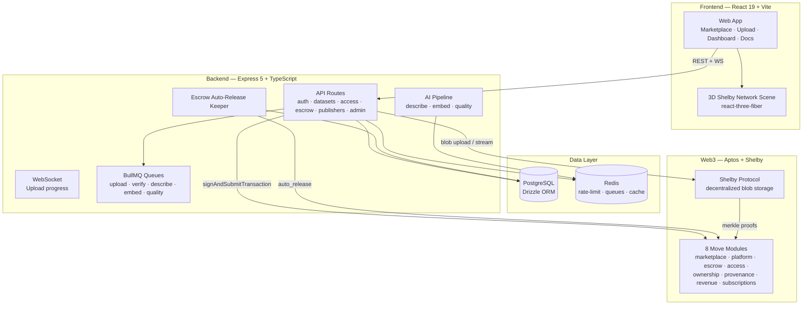

# Verida AI — Complete Documentation

> Trust-first, on-chain AI dataset marketplace. Publishers upload datasets, get them anchored with cryptographic provenance on **Aptos**, and sell or subscribe them — while buyers discover, verify, and pay for data through wallet-based access. Storage is decentralized via the **Shelby Protocol**.

---

## Table of Contents

- [1. Overview](#1-overview)
- [2. Technology Stack](#2-technology-stack)
- [3. Monorepo Layout](#3-monorepo-layout)
- [4. Getting Started](#4-getting-started)
- [5. Environment Variables](#5-environment-variables)
- [6. Smart Contracts (Move)](#6-smart-contracts-move)
- [7. Backend API](#7-backend-api)
- [8. AI Pipeline](#8-ai-pipeline)
- [9. Frontend](#9-frontend)
- [10. Database Schema](#10-database-schema)
- [11. Authentication (SIWA / AIP-62)](#11-authentication-siwa--aip-62)
- [12. Escrow & Auto-Release Keeper](#12-escrow--auto-release-keeper)
- [13. Deployment](#13-deployment)
- [14. Testing](#14-testing)
- [15. Scripts](#15-scripts)
- [16. Security](#16-security)
- [17. Architecture Diagrams](#17-architecture-diagrams)
- [18. Existing Documentation Files](#18-existing-documentation-files)

---

## 1. Overview

Modern AI training has a data credibility problem: no trust, no verified provenance, data poisoning risk, and no economic model for contributors. Verida AI solves this with cryptographic provenance receipts, merkle-root integrity verification, Shelby Protocol decentralized storage, and on-chain micropayments.

| Feature | Description |
|---------|-------------|
| **Wallet-Native Auth** | Sign in with Aptos wallet (Petra). No passwords, no emails. |
| **Dataset Publishing** | Upload any file type. Streams to Shelby, computes merkle root, registers on-chain, runs AI pipeline. |
| **Marketplace** | Browse, search (lexical + semantic), filter by category. Live integrity badges and provenance timelines. |
| **Payments & Escrow** | Pay-per-access, escrowed purchases with 7-day dispute window, auto-release keeper. |
| **AI Intelligence** | Content-type detection, AI-generated descriptions, quality scoring, semantic embeddings. |
| **Revenue Ledger** | Every paid transaction mirrored into on-chain payments ledger with fee split. |

---

## 2. Technology Stack

| Layer | Technology |
|-------|-----------|
| **Frontend** | React 19, Vite 7, TypeScript, Tailwind CSS 4, Framer Motion, Phosphor Icons, React Router 7, react-three-fiber / drei (3D) |
| **Backend** | Node.js 22, Express 5, TypeScript, Zod, multer, helmet, morgan, ws (WebSocket) |
| **Database** | PostgreSQL 16, Drizzle ORM, postgres.js driver |
| **Cache / Queues** | Redis 7, ioredis, BullMQ, express-rate-limit + rate-limit-redis |
| **Blockchain** | Aptos TS SDK 5.1.6 (pinned for Shelby compat), Move smart contracts, Petra wallet |
| **Storage** | `@shelby-protocol/sdk` — decentralized blob storage with merkle proofs |
| **AI** | `@google/generative-ai` (Gemini 2.5 Flash + embeddings), Groq (Llama 3.1), Anthropic (Claude Haiku), OpenAI (embeddings fallback) |
| **Testing** | Vitest, Supertest-style API tests |
| **DevOps** | Docker / Docker Compose, Render (API + worker), Vercel (frontend), ESLint + Prettier |

---

## 3. Monorepo Layout

```
verida-ai/
├── apps/
│   ├── web/                        # Frontend — React 19 + Vite + Tailwind 4
│   │   └── src/
│   │       ├── pages/              # 25+ route pages
│   │       ├── components/         # UI kit, 3D scene, provenance tree, escrow UI
│   │       ├── context/            # AuthContext (JWT) + WalletContext (Aptos signing)
│   │       ├── api/client.ts       # Typed API client
│   │       └── lib/contracts.ts    # On-chain payload builders (client side)
│   └── api/                        # Backend — Express 5 + Drizzle ORM
│       └── src/
│           ├── routes/             # auth, datasets, access, escrow, publishers, admin, ws
│           ├── lib/
│           │   ├── shelby/         # Shelby storage: upload, download, verify, provenance
│           │   ├── contracts/      # Aptos client, payload builders, escrow keeper+sync
│           │   ├── db/             # Drizzle schema, client, migrations
│           │   └── queue/          # BullMQ queue + workers
│           ├── ai/                 # analyzers/, pipelines/, workers/, serving/
│           ├── middleware/         # requireAuth (JWT), rate limiting
│           └── scripts/            # seed-demo, escrow E2E, backfills, merkle tools
├── contracts/
│   └── verida_marketplace/         # Move smart contracts (8 modules)
│       └── sources/                # *.move — deployed to shelbynet
├── packages/
│   └── shared/                     # Shared TS types (Dataset, ProvenanceReceipt, …)
├── drizzle/                        # Legacy hand-written SQL (kept for reference)
├── docker-compose.yml              # api + keeper + postgres + redis + adminer
├── Dockerfile                      # Multi-stage node:22-alpine build
├── render.yaml                     # Render: web service + background worker
├── vercel.json                     # Vercel frontend deploy + SPA rewrites
└── drizzle.config.ts               # Drizzle Kit config
```

---

## 4. Getting Started

### Prerequisites

- **Node.js 22.12** (see `.node-version`)
- **PostgreSQL 16** and **Redis 7** (local, hosted, or via Docker)
- A **Petra** (or any Aptos) wallet extension
- Optional: a **Shelby API key**, and a **Google AI Studio key** for AI features

### Install & Run

```bash
# 1. Install dependencies
npm install

# 2. Configure environment
cp .env.example .env
# Then edit .env with your DATABASE_URL, JWT_SECRET, API keys, etc.

# 3. Start Postgres + Redis
docker-compose up -d postgres redis

# 4. Push database schema
npm run db:push

# 5. Start dev servers (web + API)
npm run dev
```

- **Frontend:** http://localhost:5173
- **API:** http://localhost:4000 (`/healthz` for health check)

### Run individually

```bash
npm run dev --workspace @verida/web    # Vite dev server
npm run dev --workspace @verida/api    # tsx watch with live reload
```

### Docker (full stack)

```bash
docker compose up --build
```

Starts 5 services: API (`:4000`), keeper, Postgres (`:5432`), Redis (`:6379`), Adminer (`:8080`).

---

## 5. Environment Variables

### Core

| Variable | Purpose | Default |
|----------|---------|---------|
| `DATABASE_URL` | PostgreSQL connection string | — |
| `REDIS_URL` | Redis connection string | `redis://localhost:6379` |
| `JWT_SECRET` | Secret for signing JWTs | `change-me` |
| `VITE_API_URL` | Frontend → API base URL | `http://localhost:4000` |
| `PORT` | API port | `4000` |
| `NODE_ENV` | `production` hides error details | — |

### Shelby Protocol

| Variable | Purpose | Default |
|----------|---------|---------|
| `SHELBY_API_KEY` | Shelby storage API key | — |
| `SHELBY_RPC_URL` | Shelby RPC endpoint | `https://api.shelbynet.shelby.xyz/shelby` |
| `SHELBY_NETWORK` | Shelby network | `shelbynet` |
| `SHELBY_LOCATION` | Blob location hint | `shelbynet-1` |
| `SHELBY_SIGNER_PRIVATE_KEY` | Signer for uploads + keeper auto_release | — |

### Aptos / Contracts

| Variable | Purpose | Default |
|----------|---------|---------|
| `APTOS_NODE_URL` | Aptos fullnode | `https://fullnode.testnet.aptoslabs.com` |
| `APTOS_NETWORK` | Aptos network | `testnet` |
| `MARKETPLACE_CONTRACT_ADDRESS` | Deployed contract account | `0x141a…fddd` |
| `PLATFORM_TREASURY_ADDRESS` | Fee treasury address | `0x141a…fddd` |
| `VITE_MARKETPLACE_CONTRACT_ADDRESS` | Same, for the frontend | `0x141a…fddd` |

### Escrow Keeper

| Variable | Purpose | Default |
|----------|---------|---------|
| `ESCROW_KEEPER_ENABLED` | Run auto-release sweep | `true` |
| `ESCROW_KEEPER_INTERVAL_MS` | Sweep interval (min 60s) | `3600000` |

### AI (all optional, degrade gracefully)

| Variable | Purpose | Default |
|----------|---------|---------|
| `GOOGLE_AI_API_KEY` | Gemini 2.5 Flash + embeddings | — |
| `GROQ_API_KEY` | Llama 3.1 fallback | — |
| `ANTHROPIC_API_KEY` | Claude fallback | — |
| `OPENAI_API_KEY` | OpenAI embeddings fallback | — |
| `AI_DESCRIBE_ENABLED` | Enable AI descriptions | `true` |
| `AI_EMBED_ENABLED` | Enable embeddings | `true` |
| `AI_QUALITY_ENABLED` | Enable quality scoring | `true` |
| `AI_SEMANTIC_WEIGHT` | Semantic-vs-lexical search blend | `0.7` |
| `FRAUD_AUTO_BLOCK_THRESHOLD` | Auto-block fraud threshold | `0.9` |
| `FRAUD_HUMAN_REVIEW_THRESHOLD` | Flag for review threshold | `0.7` |

---

## 6. Smart Contracts (Move)

**Package:** `verida_marketplace` v0.1.0  
**Deployed Address:** `0x141a8b5da194f039af93bdb7df81824a506fe73cade01138d2309aa7d497fddd`  
**Network:** shelbynet

### Modules

| Module | Purpose | Key Entry Points |
|--------|---------|-----------------|
| `verida_marketplace` | Core marketplace state & config | `init`, `set_treasury`, `set_fee`, `pause`, `unpause` |
| `platform` | Fee-splitting payments | `pay_with_fee`, `calculate_fee` (5% treasury / 95% publisher) |
| `ownership` | Dataset ownership records & transfers | `register_dataset`, `transfer_ownership`, `get_owner`, `is_owner` |
| `access` | On-chain access grants | `grant_access`, `revoke_access`, `has_access`, `get_access_expiry` |
| `escrow` | Escrowed purchases + disputes | `deposit`, `confirm_release`, `open_dispute`, `auto_release`, `initialize_vault`, `set_dispute_window` |
| `provenance` | On-chain provenance events | `emit_event`, `get_events`, `get_event_count` |
| `revenue` | Revenue accounting | `record_payment`, `get_publisher_revenue`, `get_platform_fees` |
| `subscriptions` | Monthly subscription passes | `create_subscription_plan`, `subscribe`, `renew`, `is_subscribed` |

### Escrow Module (In-Depth)

- **`EscrowVault`** — ledger of escrowed purchases (entries, statuses, timestamps)
- **`EscrowVaultCoins`** — separate coin store (upgrade-safe, APT deposits outside frozen vault)
- **`EscrowConfig`** — `dispute_window` (7 days) and `next_id`
- **Statuses:** `STATUS_PENDING` (0), `STATUS_RELEASED` (1), `STATUS_DISPUTED` (2), `STATUS_REFUNDED` (3)
- **Lifecycle:** `deposit` → pending → (buyer `confirm_release` | buyer `open_dispute` | keeper `auto_release`) → released/disputed
- **Fee split:** `floor(amount × 500 / 10_000)` to treasury, remainder to publisher
- **Upgrade note:** `init_module` does not re-run on upgrades. Use `initialize_vault` admin function after deploy.

### Provenance Event Types

```
UPLOAD (0), VERSION_ADDED (1), VERIFIED (2), TAMPER_DETECTED (3), ACCESSED (4), OWNERSHIP_TRANSFERRED (5)
```

### Subscription Tiers

| Tier | Duration | Constant |
|------|----------|----------|
| Monthly | 30 days (2,592,000s) | `DURATION_MONTHLY` |
| Quarterly | 90 days (7,776,000s) | `DURATION_QUARTERLY` |
| Annual | 365 days (31,536,000s) | `DURATION_ANNUAL` |

---

## 7. Backend API

**Base URL:** `http://localhost:4000`  
**Response Format:** `APIResponse<T>` envelope

```json
{ "success": true, "data": { … } }
{ "success": false, "error": { "code": "…", "error": "…", "details": {…} } }
```

### Auth — `/api/auth`

| Method | Path | Description | Auth |
|--------|------|-------------|------|
| `POST` | `/api/auth/nonce` | Request SIWA challenge (single-use nonce) | — |
| `POST` | `/api/auth/verify` | Verify wallet signature + auth key, issue JWT | — |

### Datasets — `/api/datasets`

| Method | Path | Description | Auth |
|--------|------|-------------|------|
| `POST` | `/api/datasets/upload` | Upload dataset (multipart, rate-limited) | ✅ |
| `GET` | `/api/datasets/` | List datasets (tags, license, publisher, pagination, search) | — |
| `GET` | `/api/datasets/semantic-search` | Hybrid semantic + lexical search | — |
| `GET` | `/api/datasets/:id` | Full dataset detail + AI profile + provenance | — |
| `POST` | `/api/datasets/:id/verify` | Trigger merkle-root integrity verification | ✅ |
| `GET` | `/api/datasets/:id/similar` | Similar datasets (embedding similarity) | — |
| `GET` | `/api/datasets/:id/stream` | Stream blob bytes from Shelby | — |

### Access — `/api/datasets/:id/access`

| Method | Path | Description | Auth |
|--------|------|-------------|------|
| `GET` | `/api/datasets/:id/access` | Check access entitlement (supports `?wallet=` param) | — |
| `POST` | `/api/datasets/:id/access` | Create an access session | ✅ |
| `POST` | `/api/access/check` | Batch entitlement check for marketplace grid | — |
| `GET` | `/api/sessions/:sessionId` | Validate an access session | — |

### Publishers — `/api/publishers`

| Method | Path | Description | Auth |
|--------|------|-------------|------|
| `GET` | `/api/publishers/:address` | Publisher profile + datasets | — |
| `PUT` | `/api/publishers/me` | Update your publisher profile | ✅ |
| `GET` | `/api/publishers/:address/revenue` | Publisher revenue ledger | ✅ |

### Escrow — `/api/escrow`

| Method | Path | Description | Auth |
|--------|------|-------------|------|
| `POST` | `/api/escrow/create` | Create an escrow entry | ✅ |
| `GET` | `/api/escrow/:id` | Escrow detail | ✅ |
| `GET` | `/api/escrow/buyer/:address` | List a buyer's escrows | ✅ |
| `POST` | `/api/escrow/:id/status` | Confirm release / open dispute (buyer only) | ✅ |

### Admin — `/api/admin`

| Method | Path | Description | Auth |
|--------|------|-------------|------|
| `POST` | `/api/admin/seed` | Seed demo datasets (ops tooling) | — |

### System

| Method | Path | Description |
|--------|------|-------------|
| `GET` | `/healthz` | Liveness + Shelby connectivity (ok / degraded) |
| `GET` | `/api/stats/live` | Platform totals (datasets, verified, accesses, bytes) |
| `GET` | `/api/keeper/status` | Escrow keeper observability |
| `GET` | `/api/price/apt` | Live APT/USD price (60s cache) |

### WebSocket

`ws://localhost:4000/ws` — clients subscribe with `{ type: 'subscribe', jobId }` to receive upload progress events.

---

## 8. AI Pipeline

Runs asynchronously after every upload, driven by BullMQ workers:

```
upload → content-type detection
           └── analyzer registry (first match wins)
                 ├── TabularAnalyzer   (CSV/Parquet/JSON — column profiles, stats)
                 ├── ImageAnalyzer     (dimensions, formats, counts)
                 ├── PdfAnalyzer       (pages, text extraction)
                 ├── VideoAnalyzer     (duration, codecs, resolution)
                 ├── AudioAnalyzer     (sample rate, channels, duration)
                 ├── ArchiveAnalyzer   (zip/tar contents)
                 └── GenericAnalyzer   (catch-all fallback)
                 └── describeWorker ──→ AI-generated description + tags
                 └── embedWorker ─────→ semantic embedding (vector)
                 └── qualityWorker ───→ quality score (0–1) + breakdown
```

### AI Components

| Component | Details |
|-----------|---------|
| **Descriptions** | Multi-provider with graceful fallback: Gemini 2.5 Flash → Groq Llama 3.1 → Claude Haiku |
| **Embeddings** | `gemini-embedding-001`, falling back to OpenAI. Cached in Redis. |
| **Quality score** | Six dimensions: completeness, consistency, uniqueness, validity, timeliness, coverage |
| **Fraud signals** | `FRAUD_AUTO_BLOCK_THRESHOLD` (0.9) auto-blocks; `FRAUD_HUMAN_REVIEW_THRESHOLD` (0.7) flags |
| **Hybrid search** | Semantic weight `0.7` vs lexical — tunable via `AI_SEMANTIC_WEIGHT` |
| **Similarity** | Cosine similarity over embeddings for `/api/datasets/:id/similar` |

### AI Directory Structure

```
apps/api/src/ai/
├── types.ts                    # AI-specific type definitions
├── queue.ts                    # AI queue management
├── analyzers/                  # Content-type analyzers
│   ├── content-type.ts         # MIME type detection
│   ├── registry.ts             # Analyzer registry
│   ├── tabular.ts              # CSV/Parquet/JSON column profiling
│   ├── image.ts                # Image dimension/format analysis
│   ├── pdf.ts                  # PDF page/text extraction
│   ├── video.ts                # Video codec/resolution analysis
│   ├── audio.ts                # Audio sample rate/channel analysis
│   ├── archive.ts              # ZIP/TAR content listing
│   └── generic.ts              # Catch-all fallback
├── pipelines/
│   ├── describe.ts             # Schema extraction + LLM description
│   └── quality.ts              # Quality scoring (6 dimensions)
├── workers/
│   ├── describeWorker.ts       # BullMQ: description + schema
│   ├── embedWorker.ts          # BullMQ: embeddings
│   └── qualityWorker.ts        # BullMQ: quality scoring
└── serving/
    ├── client.ts               # Multi-provider LLM client
    ├── cache.ts                # Redis-backed inference cache
    └── similarity.ts           # Cosine similarity computation
```

---

## 9. Frontend

### Route Map

| Route | Page | Description |
|-------|------|-------------|
| `/` | `Home.tsx` | Landing page with 3D Shelby network scene |
| `/marketplace` | `MarketplaceHome.tsx` | Marketplace discovery hub |
| `/browse` | `Browse.tsx` | Full dataset browsing with filters |
| `/categories` | `Categories.tsx` | Tag-based category browsing |
| `/datasets/:id` | `DatasetDetail.tsx` | Dataset detail: integrity badge, AI insights, provenance tree, escrow/access UI |
| `/publishers/:address` | `PublisherProfile.tsx` | Publisher profiles |
| `/upload` | `Upload.tsx` | Upload wizard with live progress + draft persistence |
| `/dashboard` | `DashboardHome.tsx` | Publisher analytics hub |
| `/dashboard/revenue` | `Revenue.tsx` | Revenue charts and earnings |
| `/dashboard/downloads` | `Downloads.tsx` | Download statistics |
| `/dashboard/settings` | `Settings.tsx` | Publisher settings |
| `/dashboard/on-chain` | `OnChainActivity.tsx` | On-chain activity view |
| `/developers` | `Developers.tsx` | Developer portal |
| `/api` | `ApiReference.tsx` | API reference documentation |
| `/sdk` | `SDKPage.tsx` | SDK documentation hub |
| `/sdk/:lang` | `SDKDetail.tsx` | Language-specific SDK docs |
| `/cli` | `CLI.tsx` | CLI documentation |
| `/github` | `GitHub.tsx` | GitHub repository link |
| `/docs/*` | `DocsLayout.tsx` | Documentation portal |
| `/blog` | `Blog.tsx` | Community blog |
| `/network` | `ShelbyNetwork.tsx` | 3D network visualization |
| `/status` | `Status.tsx` | System status page |
| `/403` | `Forbidden.tsx` | Forbidden error page |
| `/500` | `ServerError.tsx` | Server error page |
| `/503` | `ShelbyUnavailable.tsx` | Shelby unavailable page |
| `*` | `NotFound.tsx` | 404 not found page |

### Key Components

| Component | Location | Description |
|-----------|----------|-------------|
| `ProvenanceTree.tsx` | `components/` | Visual, scrollable provenance timeline |
| `IntegrityBadge` | `components/` | Live integrity verification badge |
| `OwnershipBadge` | `components/` | Ownership verification badge |
| `EscrowStatus` | `components/` | Escrow status display |
| `FeeBreakdown` | `components/` | Fee split visualization |
| `ContractStatePanel` | `components/` | Live on-chain state widget |
| `RevenueChart` | `components/` | Revenue visualization |
| `ShelbyScene` | `components/three/` | WebGL 3D scene |
| `StorageRing` | `components/three/` | Storage ring visualization |
| `FloatingCards` | `components/three/` | Floating dataset cards |
| `AIInsightPanel` | `components/three/` | AI insights panel |
| `WebGLFallback` | `components/three/` | Fallback for no WebGL |

### Frontend Directory Structure

```
apps/web/src/
├── main.tsx                    # React root with StrictMode
├── App.tsx                     # Router + all route definitions
├── api/
│   └── client.ts               # Typed API client
├── context/
│   ├── AuthContext.tsx          # JWT session management
│   └── WalletContext.tsx        # Aptos wallet signing (SIWA/AIP-62)
├── lib/
│   ├── contracts.ts            # On-chain payload builders (client side)
│   ├── guest.ts                # Guest identity management
│   └── markdown.tsx            # Markdown rendering
├── pages/                      # All page components
├── components/                 # Reusable components
└── styles/
    └── global.css              # CSS variables, Tailwind config, global styles
```

---

## 10. Database Schema

### Tables

| Table | Purpose | Key Columns |
|-------|---------|-------------|
| `publishers` | Publisher profiles + earnings | `address` (PK), `username`, `bio`, `total_datasets`, `total_earnings`, `verified` |
| `datasets` | Dataset metadata, provenance, AI profile | `id` (serial PK), `shelby_blob_id`, `name`, `description`, `tags[]`, `access_type`, `price_per_access`, `merkle_root`, `quality_score`, `embedding`, `on_chain_dataset_id` |
| `dataset_versions` | Immutable version history | `id`, `dataset_id` (FK), `version`, `shelby_blob_id`, `changelog`, `merkle_root` |
| `access_sessions` | Access grants + sessions | `id`, `dataset_id` (FK), `accessor_address`, `session_id`, `expires_at`, `status`, `on_chain_granted` |
| `provenance_chain` | Ordered provenance events | `id`, `dataset_id` (FK), `event_type`, `actor_address`, `timestamp`, `shelby_receipt`, `tx_hash` |
| `blockchain_outbox` | Blockchain submission queue | `id`, `provenance_event_id` (FK), `status`, `attempt_count`, `last_error` |
| `escrow_entries` | Off-chain escrow mirror | `id`, `on_chain_escrow_id`, `buyer_address`, `publisher_address`, `dataset_id`, `amount_octas`, `status` |
| `subscriptions` | Subscription tiers & expiry | `id`, `subscriber_address`, `dataset_id`, `tier`, `expires_at`, `active` |
| `on_chain_payments` | Revenue ledger with fee split | `id`, `payer_address`, `payee_address`, `amount_octas`, `fee_octas`, `tx_hash` |
| `community_posts` | Blog posts | `id`, `title`, `slug`, `category`, `content`, `author_address`, `status` |
| `community_comments` | Blog comments | `id`, `post_id` (FK), `author_address`, `content` |
| `community_likes` | Blog likes | `post_id` + `liker_id` (composite PK) |

### Migrations

**Canonical (apps/api/drizzle/):**

| Migration | Purpose |
|-----------|---------|
| `0000_special_bastion.sql` | Initial schema |
| `0001_ai_metadata.sql` | AI pipeline columns (schema profile, embeddings, quality) |
| `0002_giant_red_hulk.sql` | Escrow/subscriptions/on-chain payments + ownership columns |

---

## 11. Authentication (SIWA / AIP-62)

### Flow

```
1. POST /api/auth/nonce
   → wallet address → backend returns challenge message with single-use nonce

2. Wallet signs AIP-62 wrapped message
   → APTOS\nmessage: …\nnonce: …

3. POST /api/auth/verify
   → { address, message, signature }

4. Backend:
   → validates nonce (expiry, single-use, address match)
   → confirms public key derives on-chain auth key (sha3_256(pubkey ‖ 0x00))
   → verifies Ed25519 signature
   → issues JWT for all authenticated routes
```

**Signature wire format:** `"0x" + 64-hex(pubKey) + 128-hex(signature)`

---

## 12. Escrow & Auto-Release Keeper

### Keeper Loop

```
[Every ESCROW_KEEPER_INTERVAL_MS (default 1h)]
  1. Read EscrowVault + EscrowConfig from chain
  2. findExpiredEscrows → pending escrows where
     now ≥ created_at + dispute_window + 60s grace
  3. For each: escrow::auto_release(id) (signed with SHELBY_SIGNER_PRIVATE_KEY)
  4. Mirror result → escrow_entries.status = released
  5. Record fee-split payment → on_chain_payments ledger
```

### Features

- **Pure, tested core** — `extractEscrowState`, `findExpiredEscrows`, `computeFeeSplit` are exported pure functions covered by 18 unit tests
- **Observability** — `GET /api/keeper/status` reports last sweep time/duration, totals released/errored, and latest error
- **Single-runner safety** — Runs as separate container/worker; API sets `ESCROW_KEEPER_ENABLED=false`
- **Grace period** — 60-second buffer prevents clock-skew-triggered reverts
- **Env-gated** — Set `ESCROW_KEEPER_ENABLED=false` to disable entirely

---

## 13. Deployment

### Docker Compose (5 Services)

| Service | Purpose | Port |
|---------|---------|------|
| `api` | Verida API (keeper disabled) | `:4000` |
| `keeper` | Escrow auto-release loop | — |
| `postgres` | PostgreSQL 16 with healthcheck | `:5432` |
| `redis` | Redis 7 with persistence | `:6379` |
| `adminer` | DB inspector | `:8080` |

### Render (render.yaml)

- **verida-api** — Web service, `startCommand: cd apps/api && node dist/index.js`, health check `/healthz`
- **verida-keeper** — Background worker running sweep loop

### Vercel (vercel.json)

- Builds `@verida/shared` + `@verida/web`
- SPA rewrites to `index.html`
- Injects `VITE_API_URL` and contract address at build time

### Dockerfile

Multi-stage `node:22-alpine` build:
1. Install dependencies, build shared, build API
2. Production stage: copy built artifacts, expose port 4000, run `node dist/index.js`

---

## 14. Testing

### Commands

```bash
npm test                           # Run all workspace tests
npm run test --workspace @verida/api    # API tests only
npm run test --workspace @verida/web    # Frontend tests only
```

### Coverage

- **77 Vitest tests** across the API workspace (auth, access, escrow keeper, escrow sync, shelby client, queue)
- Keeper logic covered by **18 pure-function tests**

### E2E Script

```bash
npx tsx --env-file ../../.env apps/api/src/scripts/escrow-e2e-testnet.ts
```

Executes full escrow lifecycle on shelbynet: vault init → set dispute window → deposit → auto-release → fee split.

### Test Structure

```
apps/api/src/
├── routes/
│   ├── auth.test.ts
│   └── access.test.ts
├── lib/
│   ├── shelby/
│   │   └── client.test.ts
│   ├── contracts/
│   │   ├── escrowKeeper.test.ts
│   │   └── escrowSync.test.ts
│   └── queue/
│       └── queue.test.ts
```

---

## 15. Scripts

| Script | Purpose |
|--------|---------|
| `apps/api/src/scripts/seed-demo.ts` | Seed demo datasets for development |
| `apps/api/src/scripts/escrow-e2e-testnet.ts` | Full escrow lifecycle E2E test on shelbynet |
| `apps/api/src/scripts/escrow-keeper-run.ts` | Single keeper sweep runner |
| `apps/api/src/scripts/backfill-describe.ts` | Backfill AI descriptions for existing datasets |
| `apps/api/src/scripts/check-merkle.ts` | Merkle root verification tool |
| `apps/api/src/scripts/fix-merkle.ts` | Merkle root fix tool |

---

## 16. Security

### API Key Handling
- `SHELBY_API_KEY` never logged
- API key read from `process.env` only once at startup
- `.env` files in `.gitignore`

### File Upload Security
- Multer limits: max 10GB, 1 file per request
- MIME type validation server-side
- Temp files deleted after upload (finally block)
- Upload rate limited: 10/hour per IP

### Access Control
- Stream validates session before piping data
- Expired sessions return 401
- Publisher-only routes verify wallet signature

### Input Validation
- All POST/PUT validated with Zod
- Dataset `id` validated as integer
- Publisher `address` validated as Aptos format (`0x` + 64 hex)
- Pagination bounded: limit max = 100

### Database
- All queries use parameterized statements (Drizzle ORM)
- No `SELECT *` on large tables
- Cascade deletes intentional

### Rate Limiting
- Redis-backed rate limiting for upload, stream, and general endpoints
- Upload: 10 requests/hour per IP
- Stream: configurable per IP

---

## 17. Architecture Diagrams

### High-Level Architecture



### Request Flow

```
Browser ──▶ POST /api/auth/verify (SIWA signature)
             │  verifies Ed25519 sig + on-chain auth key → JWT
             ▼
POST /api/datasets/upload ──▶ BullMQ uploadWorker
             ├──▶ Shelby Protocol (blob + merkle root)
             ├──▶ ownership::register_dataset (on-chain)
             ├──▶ AI describe → embed → quality (async)
             └──▶ WebSocket progress → browser

Buyer ──▶ POST /api/datasets/:id/access
             └──▶ access::grant_access (on-chain session)

Buyer ──▶ escrow::deposit → APT locked for 7 days
             ├── buyer confirms → escrow::confirm_release → 95% publisher / 5% treasury
             ├── buyer disputes → escrow::open_dispute
             └── keeper (after window) → escrow::auto_release
```

---

## 18. Existing Documentation Files

| File | Contents |
|------|----------|
| `README.md` | Comprehensive project overview, architecture, API reference, getting started |
| `Plan.md` | Original architecture & agent-driven build plan |
| `Build.md` | Agent-based implementation workflow (OpenCode/Qwen/Codex) |
| `AI_Integration.md` | AI pipeline design & env-var contract |
| `Test.md` | Test strategy, unit/integration/E2E test specs |
| `Review.md` | Code review checklist (security, Shelby, code quality) |
| `UI.md` | Complete UI specification (1500+ lines), design tokens, component specs |
| `DESIGN.md` | Design system toolkit, animation principles |
| `FRONTEND_DESIGN.md` | Cyber Luxury theme, color tokens, typography, component styles |
| `DOCUMENTATION.md` | This file |

---

<p align="center">
  Built with ❤️ on Aptos + Shelby Protocol — <em>trust-first data for the AI era.</em>
</p>
