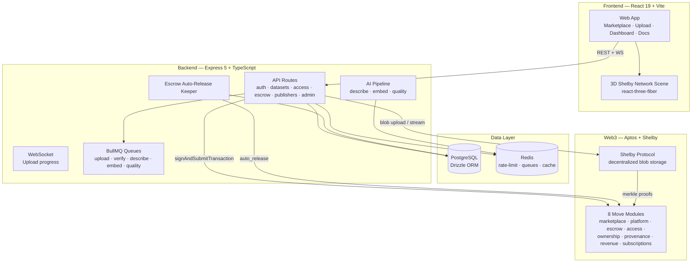

<p align="center">
  
  
  
  
  
</p>

# Verida AI

> **A trust-first, on-chain AI dataset marketplace.** Publishers upload datasets, get them anchored with cryptographic provenance on **Aptos**, and sell or subscribe them — while buyers discover, verify, and pay for data through wallet-based access. Storage is decentralized via the **Shelby Protocol**.

Verida AI is a full-stack monorepo that combines a **React 19 frontend**, an **Express 5 + Drizzle API**, **8 deployed Move smart contracts** on Aptos, and a **multimodal AI pipeline** that describes, scores, and embeds datasets automatically. Every dataset gets an immutable provenance chain, a merkle-root integrity proof, and an on-chain ownership record.

---

## 📑 Table of Contents

- [Why Verida AI](#why-verida-ai)
- [Feature Overview](#-feature-overview)
- [Architecture](#-architecture)
- [Monorepo Layout](#-monorepo-layout)
- [Technology Stack](#-technology-stack)
- [On-Chain Contracts (Move)](#-on-chain-contracts-move)
- [Backend API](#-backend-api)
- [AI Pipeline](#-ai-pipeline)
- [Escrow & the Auto-Release Keeper](#-escrow--the-auto-release-keeper)
- [Frontend](#-frontend)
- [Getting Started](#-getting-started)
- [Environment Variables](#-environment-variables)
- [Database & Migrations](#-database--migrations)
- [Docker](#-docker)
- [Deployment (Render + Vercel)](#-deployment-render--vercel)
- [Testing](#-testing)
- [Project Scripts](#-project-scripts)
- [Documentation](#-documentation)
- [License](#-license)

---

## Why Verida AI

Modern AI training has a data credibility problem:

- ❌ **No trust or transparency** — anyone can claim a dataset is "clean" or "original."
- ❌ **No verified provenance** — who uploaded what, and when?
- ❌ **Data poisoning risk** — no way to detect tampering after distribution.
- ❌ **No economic model** — dataset contributors rarely get paid fairly.

Verida AI answers each one:

| Problem | Solution |
|---|---|
| No trust in datasets | **Cryptographic provenance receipts** anchored on-chain for every upload |
| Tampering risk | **Merkle-root integrity verification** — datasets can be checked at any time |
| Fragmented distribution | **Shelby Protocol** decentralized storage with a single global namespace |
| No monetization | **Pay-per-access, subscriptions, and escrowed micropayments** on Aptos |

---

## ✨ Feature Overview

### 🔐 Wallet-Native Authentication (SIWA / AIP-62)
Sign in with your Aptos wallet (Petra or any adapter). No passwords, no emails. The backend verifies the Ed25519 signature *and* the on-chain authentication key before issuing a JWT.

### 📦 Dataset Publishing with Provenance
Upload any file (tabular, images, video, audio, PDF, archives, text). The API:
1. Streams the file to **Shelby Protocol** storage (with a local dev fallback).
2. Computes a **merkle root** and writes a **provenance receipt**.
3. Registers the dataset **on-chain** (`ownership::register_dataset`).
4. Runs the **AI pipeline** to describe, score, and embed the dataset.

### 🛒 Marketplace & Access Control
Browse, search (lexical + semantic), filter by category, and inspect detailed dataset pages with live integrity badges, provenance timelines, and quality scores. Access is granted via **on-chain sessions** (`access::grant_access`) — free or paid.

### 💸 Payments, Escrow & Disputes
- **Platform payments** split a fee to the treasury and the rest to the publisher (`platform::pay_with_fee`).
- **Escrowed purchases** lock APT until the buyer confirms or the **7-day dispute window** expires.
- An **auto-release keeper** (background worker) sweeps expired escrows and mirrors results into the revenue ledger.

### 🤖 AI Dataset Intelligence
- **Content-type detection** + per-modality analyzers (tabular, image, PDF, video, audio, archive).
- **AI-generated descriptions** (multi-provider fallback: Gemini → Groq → Claude).
- **Quality scoring** (completeness, consistency, uniqueness, validity, timeliness, coverage).
- **Semantic embeddings** for hybrid search and "similar datasets" recommendations.

### 🧾 Revenue Ledger & Publisher Dashboard
Every paid transaction is mirrored into an `on_chain_payments` ledger with the exact fee split. Publishers get a dashboard with revenue charts, download stats, and on-chain activity.

### 🛡️ Security & Operations
Helmet, CORS, Redis-backed rate limiting (upload / stream / general), Zod validation, typed error responses, graceful shutdown, and a health endpoint that reports Shelby availability.

---

## 🧱 Architecture



### Request flow at a glance

```
Browser ──▶ POST /api/auth/verify (SIWA signature)
             │  verifies Ed25519 sig + on-chain auth key → JWT
             ▼
POST /api/datasets/upload ──▶ BullMQ uploadWorker
             ├──▶ Shelby Protocol (blob + merkle root)
             ├──▶ ownership::register_dataset (on-chain)
             ├──▶ AI describe → embed → quality (async)
             └──▶ WebSocket progress → browser

Buyer ──▶ POST /api/datasets/:id/access
             └──▶ access::grant_access (on-chain session)

Buyer ──▶ escrow::deposit → APT locked for 7 days
             ├── buyer confirms → escrow::confirm_release → 95% publisher / 5% treasury
             ├── buyer disputes → escrow::open_dispute
             └── keeper (after window) → escrow::auto_release
```

---

## 📁 Monorepo Layout

```
verida-ai/
├── apps/
│   ├── web/                        # Frontend — React 19 + Vite + Tailwind 4
│   │   └── src/
│   │       ├── pages/              # 25+ route pages (Home, Browse, DatasetDetail, …)
│   │       ├── components/         # UI kit, 3D scene, provenance tree, escrow UI…
│   │       ├── context/            # AuthContext (JWT) + WalletContext (Aptos signing)
│   │       ├── api/client.ts       # Typed API client
│   │       └── lib/contracts.ts    # On-chain payload builders (client side)
│   └── api/                        # Backend — Express 5 + Drizzle ORM
│       └── src/
│           ├── routes/             # auth, datasets, access, escrow, publishers, admin, ws
│           ├── lib/
│           │   ├── shelby/         # Shelby storage: upload, download, verify, provenance
│           │   ├── contracts/      # Aptos client, payload builders, escrow keeper+sync
│           │   ├── db/             # Drizzle schema, client, migrations
│           │   └── queue/          # BullMQ queue + upload/verify workers
│           ├── ai/                 # analyzers/, pipelines/, workers/, serving/
│           ├── middleware/         # requireAuth (JWT), rate limiting
│           └── scripts/            # seed-demo, escrow E2E, backfills, merkle tools
├── contracts/
│   └── verida_marketplace/         # Move smart contracts (8 modules)
│       └── sources/                # *.move — deployed to shelbynet
├── packages/
│   └── shared/                     # Shared TS types (Dataset, ProvenanceReceipt, …)
├── drizzle/                        # Legacy hand-written SQL (kept for reference)
├── docker-compose.yml              # api + keeper + postgres + redis + adminer
├── Dockerfile                      # Multi-stage node:22-alpine build
├── render.yaml                     # Render: web service + background worker
├── vercel.json                     # Vercel frontend deploy + SPA rewrites
└── drizzle.config.ts               # Drizzle Kit config
```

---

## 🧰 Technology Stack

| Layer | Technology |
|---|---|
| **Frontend** | React 19 · Vite 7 · TypeScript · Tailwind CSS 4 · Framer Motion · Phosphor Icons · React Router 7 · react-three-fiber / drei (3D) |
| **Backend** | Node.js 22 · Express 5 · TypeScript · Zod · multer · helmet · morgan · ws (WebSocket) |
| **Database** | PostgreSQL 16 · Drizzle ORM · postgres.js driver |
| **Cache / Queues** | Redis 7 · ioredis · BullMQ · express-rate-limit + rate-limit-redis |
| **Blockchain** | Aptos TS SDK `^5.2.1` · Move smart contracts · Petra wallet |
| **Storage** | `@shelby-protocol/sdk` `0.7.1` — decentralized blob storage with merkle proofs (v2 chunkset upload protocol) |
| **AI** | `@google/generative-ai` (Gemini 2.5 Flash + embeddings) · Groq (Llama 3.1) · Anthropic (Claude Haiku) · OpenAI (embeddings fallback) |
| **Testing** | Vitest · Supertest-style API tests |
| **DevOps** | Docker / Docker Compose · Render (web + worker) · Vercel · ESLint + Prettier |

---

## 🔗 On-Chain Contracts (Move)

Eight Move modules live in `contracts/verida_marketplace/` and are **published and live on shelbynet** at:

```
0x141a8b5da194f039af93bdb7df81824a506fe73cade01138d2309aa7d497fddd
```

| Module | Purpose | Key entry points |
|---|---|---|
| `verida_marketplace` | Core marketplace state & dataset registry | init, dataset metadata |
| `platform` | Fee-splitting payments | `pay_with_fee`, `calculate_fee` (5% treasury / 95% publisher) |
| `ownership` | Dataset ownership records & transfers | `register_dataset`, `transfer_ownership` |
| `access` | On-chain access grants | `grant_access(accessor, dataset, duration)` |
| `escrow` | Escrowed purchases + disputes | `deposit`, `confirm_release`, `open_dispute`, `auto_release`, `initialize_vault`, `set_dispute_window` |
| `provenance` | On-chain provenance events | append / read event records |
| `revenue` | Revenue accounting | fee & payout accounting |
| `subscriptions` | Monthly subscription passes | tier management, renewals |

### Escrow module (in depth)

- **`EscrowVault`** — the ledger of escrowed purchases (entries, statuses, timestamps).
- **`EscrowVaultCoins`** — a separate coin store added in an upgrade-safe way so APT deposits live outside the (frozen) vault layout.
- **`EscrowConfig`** — `dispute_window` (7 days by default) and `next_id`.
- **Lifecycle**: `deposit` → pending → (buyer `confirm_release` | buyer `open_dispute` | keeper `auto_release` after window + grace) → released/disputed.
- **Fee split on release**: `floor(amount × 500 / 10_000)` goes to the treasury, the remainder to the publisher — recorded in the on-chain payment payload and mirrored to the DB ledger.

> **Upgrade note:** `init_module` does **not** re-run on module upgrades on Aptos, so the escrow module exposes an idempotent `initialize_vault` admin function to create the coin store after a deploy.

---

## 🛰 Backend API

Base URL: `http://localhost:4000` (or your deployed API). All responses follow the `APIResponse<T>` envelope:

```json
{ "success": true, "data": { … } }
{ "success": false, "error": { "code": "…", "error": "…", "details": {…} } }
```

### Auth — `/api/auth`
| Method | Path | Description | Auth |
|---|---|---|---|
| `POST` | `/api/auth/nonce` | Request a SIWA challenge (single-use nonce) | — |
| `POST` | `/api/auth/verify` | Verify wallet signature + auth key, issue JWT | — |

### Datasets — `/api/datasets`
| Method | Path | Description | Auth |
|---|---|---|---|
| `POST` | `/api/datasets/upload` | Upload a dataset (multipart, rate-limited) | ✅ |
| `GET` | `/api/datasets/` | List datasets (tags, license, publisher, pagination, search) | — |
| `GET` | `/api/datasets/semantic-search` | Hybrid semantic + lexical search | — |
| `GET` | `/api/datasets/:id` | Full dataset detail + AI profile + provenance | — |
| `POST` | `/api/datasets/:id/verify` | Trigger merkle-root integrity verification | ✅ |
| `GET` | `/api/datasets/:id/similar` | Similar datasets (embedding similarity) | — |
| `GET` | `/api/datasets/:id/stream` | Stream blob bytes from Shelby | — |

### Access, Publishers, Escrow, Admin
| Method | Path | Description | Auth |
|---|---|---|---|
| `POST` | `/api/datasets/:id/access` | Create an access session | ✅ |
| `GET` | `/api/sessions/:sessionId` | Validate an access session | — |
| `GET` | `/api/publishers/:address` | Publisher profile + datasets | — |
| `PUT` | `/api/publishers/me` | Update your publisher profile | ✅ |
| `GET` | `/api/publishers/:address/revenue` | Publisher revenue ledger | ✅ |
| `POST` | `/api/escrow/create` | Create an escrow entry | ✅ |
| `GET` | `/api/escrow/:id` | Escrow detail | ✅ |
| `GET` | `/api/escrow/buyer/:address` | List a buyer's escrows | ✅ |
| `POST` | `/api/escrow/:id/status` | Confirm release / open dispute (buyer only) | ✅ |
| `POST` | `/api/admin/seed` | Seed demo datasets (ops tooling) | — |

### System
| Method | Path | Description |
|---|---|---|
| `GET` | `/healthz` | Liveness + Shelby connectivity (ok / degraded) |
| `GET` | `/health/storage` | Storage-layer health: Shelby RPC reachability + Cloudinary config |
| `GET` | `/api/stats/live` | Platform totals (datasets, verified, accesses, bytes) |
| `GET` | `/api/keeper/status` | Escrow keeper observability (last sweep, released/errors) |
| `GET` | `/api/price/apt` | Live APT/USD price (Binance → Coinbase → CoinGecko, 60s cache) |

### WebSocket
`ws://localhost:4000/ws` — clients subscribe with `{ type: 'subscribe', jobId }` to receive upload progress events (`percent`, `bytesUploaded`, `stage`, completion, errors).

---

## 🤖 AI Pipeline

Runs asynchronously after every upload, driven by BullMQ workers:

```
upload ──▶ content-type detection
            └──▶ analyzer registry (first match wins)
                  ├── TabularAnalyzer   (CSV/Parquet/JSON — column profiles, stats)
                  ├── ImageAnalyzer     (dimensions, formats, counts)
                  ├── PdfAnalyzer       (pages, text extraction)
                  ├── VideoAnalyzer     (duration, codecs, resolution)
                  ├── AudioAnalyzer     (sample rate, channels, duration)
                  ├── ArchiveAnalyzer   (zip/tar contents)
                  └── GenericAnalyzer   (catch-all fallback)
                  └──▶ describeWorker ──▶ AI-generated description + tags
                  └──▶ embedWorker ─────▶ semantic embedding (vector)
                  └──▶ qualityWorker ───▶ quality score (0–1) + breakdown
```

| Component | Details |
|---|---|
| **Descriptions** | Multi-provider with graceful fallback: Gemini 2.5 Flash → Groq Llama 3.1 → Claude Haiku. All keys optional. |
| **Embeddings** | `gemini-embedding-001`, falling back to OpenAI. Cached in Redis. |
| **Quality score** | Six dimensions: completeness, consistency, uniqueness, validity, timeliness, coverage. |
| **Fraud signals** | `FRAUD_AUTO_BLOCK_THRESHOLD` (0.9) auto-blocks suspicious uploads; `FRAUD_HUMAN_REVIEW_THRESHOLD` (0.7) flags for review. |
| **Hybrid search** | Semantic weight `0.7` vs lexical — tunable via `AI_SEMANTIC_WEIGHT`. |
| **Similarity** | Cosine similarity over embeddings for `/api/datasets/:id/similar`. |
| **Feature flags** | `AI_DESCRIBE_ENABLED`, `AI_EMBED_ENABLED`, `AI_QUALITY_ENABLED`. |

---

## 💰 Escrow & the Auto-Release Keeper

Purchases can be **escrowed on-chain**: the buyer's APT is locked in `EscrowVaultCoins` until release. Because a buyer might vanish or stall, a background **keeper** guarantees resolution:

```
[Keeper loop] every ESCROW_KEEPER_INTERVAL_MS (default 1h)
  1. Read EscrowVault + EscrowConfig from the chain
  2. findExpiredEscrows → pending escrows where
     now ≥ created_at + dispute_window + 60s grace
  3. For each: escrow::auto_release(id) (signed with SHELBY_SIGNER_PRIVATE_KEY)
  4. Mirror result → escrow_entries.status = released
  5. Record fee-split payment → on_chain_payments ledger
```

- **Pure, tested core** — `extractEscrowState`, `findExpiredEscrows`, and `computeFeeSplit` are exported pure functions covered by 18 unit tests.
- **Observability** — `GET /api/keeper/status` reports last sweep time/duration, totals released/errored, and the latest error.
- **Single-runner safety** — the keeper runs as a *separate* container/worker (docker-compose `keeper`, Render `verida-keeper`), and the API sets `ESCROW_KEEPER_ENABLED=false` so only one instance sweeps. Concurrent runners are safe on-chain but noisy.
- **Grace period** — a 60-second buffer prevents clock-skew-triggered reverts on the `now >= created_at + window` assertion.
- **Env-gated** — set `ESCROW_KEEPER_ENABLED=false` to disable entirely.
- **E2E proven** — a full lifecycle (initialize vault → set window → deposit → auto-release → fee split) was executed live on shelbynet: 6/6 checks passed.

---

## 🎨 Frontend

A dark, data-dense UI with an electric-teal accent, 3D network visualizations, and a full developer portal.

| Route | Page |
|---|---|
| `/` | Landing page with 3D Shelby network scene |
| `/marketplace` `/browse` `/categories` | Marketplace discovery, browsing, tag categories |
| `/datasets/:id` | Dataset detail: integrity badge, AI insights, provenance tree, escrow/access UI |
| `/publishers/:address` | Publisher profiles |
| `/upload` | Upload wizard with live progress + draft persistence |
| `/dashboard` | Publisher analytics hub |
| `/dashboard/revenue` `/downloads` `/settings` `/on-chain` | Revenue charts, downloads, settings, on-chain activity |
| `/developers` `/api` `/sdk` `/sdk/:lang` `/cli` `/github` | Developer portal, API reference, SDK docs, CLI |
| `/docs/*` | Documentation portal |
| `/blog` `/network` `/status` | Community blog, network view, system status |
| `/403` `/500` `/503` `*` | Error pages |

**Notable components:**
- `components/three/` — WebGL Shelby scene (`ShelbyScene`, `StorageRing`, `FloatingCards`, `AIInsightPanel`) with a `WebGLFallback` and error boundary.
- `ProvenanceTree.tsx` — visual, scrollable provenance timeline of on-chain events.
- `IntegrityBadge` / `OwnershipBadge` / `EscrowStatus` / `FeeBreakdown` / `ContractStatePanel` — live on-chain state widgets.
- `context/AuthContext` + `WalletContext` — JWT session + Aptos wallet signing (SIWA / AIP-62).

---

## 🚀 Getting Started

### Prerequisites

- **Node.js 22.12** (see `.node-version`)
- **PostgreSQL 16** and **Redis 7** (local, hosted, or via Docker)
- A **Petra** (or any Aptos) wallet extension
- Optional: a **Shelby API key**, and a **Google AI Studio key** for AI features (free tier)

### 1. Install dependencies

```bash
npm install
```

This provisions all three workspaces (`apps/web`, `apps/api`, `packages/shared`) via npm workspaces.

### 2. Configure environment

```bash
cp .env.example .env   # then fill in DATABASE_URL, JWT_SECRET, keys…
```

### 3. Start infrastructure (Postgres + Redis)

```bash
docker-compose up -d postgres redis
```

### 4. Run migrations

```bash
npm run db:push        # push schema directly (dev)
# or, for tracked migrations:
npm run db:generate    # generate a new migration from schema changes
```

> The API also runs `runMigrations()` automatically at boot (see `apps/api/src/lib/db/migrate.ts`).

### 5. Start the dev servers

```bash
npm run dev
```

- Frontend: http://localhost:5173
- API: http://localhost:4000 (`/healthz` for a health check)

Run individually:

```bash
npm run dev --workspace @verida/web    # Vite dev server
npm run dev --workspace @verida/api    # tsx watch with live reload
```

### 6. Log in & upload

Connect your Aptos wallet → sign the SIWA message → upload a dataset and watch the AI pipeline describe, score, and embed it.

---

## 🔐 Authentication Flow (SIWA / AIP-62)

1. `POST /api/auth/nonce` with your wallet address → backend returns a challenge message with a **single-use nonce**.
2. Your wallet signs the AIP-62 wrapped message (`APTOS\nmessage: …\nnonce: …`).
3. `POST /api/auth/verify` with `{ address, message, signature }`.
4. Backend:
   - validates nonce (expiry, single-use, address match),
   - confirms the public key derives the on-chain **authentication key** (`sha3_256(pubkey ‖ 0x00)`),
   - cryptographically verifies the **Ed25519** signature,
   - issues a **JWT** used for all authenticated routes.

Signature wire format: `"0x" + 64-hex(pubKey) + 128-hex(signature)`.

---

## ⚙️ Environment Variables

| Variable | Purpose | Default |
|---|---|---|
| `DATABASE_URL` | PostgreSQL connection string | — |
| `REDIS_URL` | Redis connection string | `redis://localhost:6379` |
| `JWT_SECRET` | Secret for signing JWTs | `change-me` |
| `VITE_API_URL` | Frontend → API base URL | `http://localhost:4000` |
| **Shelby** | | |
| `SHELBY_API_KEY` | Shelby storage API key | — |
| `SHELBY_RPC_URL` | Shelby RPC endpoint (passed to the SDK itself, so `putBlob`/`getBlob` hit it) | `https://shelby.shelbynet.shelby.xyz/shelby` |
| `SHELBY_INDEXER_URL` | Shelby blob indexer (GraphQL); optional — defaults to the shelbynet indexer | — |
| `SHELBY_NETWORK` | Shelby network | `shelbynet` |
| `SHELBY_LOCATION` | Blob location hint | `shelbynet-1` |
| `SHELBY_SIGNER_PRIVATE_KEY` | Signer for uploads **and** keeper `auto_release` txs (needs APT for gas) | — |
| **Aptos / Contracts** | | |
| `APTOS_NODE_URL` | Aptos fullnode | `https://fullnode.testnet.aptoslabs.com` |
| `APTOS_NETWORK` | Aptos network | `testnet` |
| `MARKETPLACE_CONTRACT_ADDRESS` | Deployed contract account | `0x141a…fddd` |
| `PLATFORM_TREASURY_ADDRESS` | Fee treasury address | `0x141a…fddd` |
| `VITE_MARKETPLACE_CONTRACT_ADDRESS` | Same, for the frontend | `0x141a…fddd` |
| **Escrow keeper** | | |
| `ESCROW_KEEPER_ENABLED` | Run auto-release sweep | `true` (set `false` on non-keeper instances) |
| `ESCROW_KEEPER_INTERVAL_MS` | Sweep interval (min 60s) | `3600000` |
| **AI (all optional, degrade gracefully)** | | |
| `GOOGLE_AI_API_KEY` | Gemini 2.5 Flash + embeddings | — |
| `GROQ_API_KEY` | Llama 3.1 fallback | — |
| `ANTHROPIC_API_KEY` | Claude fallback | — |
| `OPENAI_API_KEY` | OpenAI embeddings fallback | — |
| `AI_DESCRIBE_ENABLED` / `AI_EMBED_ENABLED` / `AI_QUALITY_ENABLED` | AI feature flags | `true` |
| `AI_SEMANTIC_WEIGHT` | Semantic-vs-lexical search blend | `0.7` |
| `FRAUD_AUTO_BLOCK_THRESHOLD` / `FRAUD_HUMAN_REVIEW_THRESHOLD` | Quality fraud gates | `0.9` / `0.7` |
| `PORT` | API port | `4000` |
| `NODE_ENV` | `production` hides error details | — |

---

## 🗄 Database & Migrations

Tables (Drizzle schema in `apps/api/src/lib/db/schema.ts`):

| Table | Purpose |
|---|---|
| `datasets` | Dataset metadata, provenance receipt, AI profile, on-chain ids |
| `dataset_versions` | Immutable version history |
| `access_sessions` | On-chain access grants + on-chain grant tracking |
| `publishers` | Publisher profiles + earnings |
| `provenance_chain` | Ordered provenance events (UPLOAD, VERIFIED, TAMPER_DETECTED, ACCESSED, OWNERSHIP_TRANSFERRED…) |
| `escrow_entries` | Off-chain mirror of on-chain escrows |
| `subscriptions` | Subscription tiers & expiry |
| `on_chain_payments` | Revenue ledger with fee split (payer, payee, fee, tx hash) |

Tracked migrations live in `apps/api/drizzle/`:

```
0000_special_bastion.sql   # initial schema
0001_ai_metadata.sql       # AI pipeline columns (schema profile, embeddings, quality)
0002_giant_red_hulk.sql    # escrow / subscriptions / on-chain payments + ownership columns
```

> The root `drizzle/` folder holds legacy hand-written SQL (0002–0006) kept for reference; the canonical migration history is `apps/api/drizzle/`.

---

## 🐳 Docker

```bash
docker compose up --build
```

Starts five services:

| Service | Purpose |
|---|---|
| `api` | Verida API on `:4000` (keeper disabled — the dedicated service owns it) |
| `keeper` | Escrow auto-release loop (sweep → sleep `ESCROW_KEEPER_INTERVAL_MS`) |
| `postgres` | PostgreSQL 16 with healthcheck |
| `redis` | Redis 7 with persistence |
| `adminer` | DB inspector at `:8080` |

---

## 🚀 Deployment (Render + Vercel)

**API + keeper — Render** (`render.yaml`):
- `verida-api` — web service, `startCommand: cd apps/api && node dist/index.js`, health check `/healthz`.
- `verida-keeper` — background **worker** running the sweep loop (Render free tier has no cron; swap for a cron job on a paid plan).

**Frontend — Vercel** (`vercel.json`):
- Builds `@verida/shared` + `@verida/web`, SPA rewrites to `index.html`, injects `VITE_API_URL` and the contract address at build time.

The `Dockerfile` is a multi-stage `node:22-alpine` build (shared → api) used by docker-compose.

---

## 🧪 Testing

```bash
npm test
```

- **62 Vitest tests** across the API workspace (auth, access, escrow keeper, escrow sync, shelby client, queue) — 61 passing; the remaining failure is a known, pre-existing case in `auth.test.ts`.
- Keeper logic is covered by **18 pure-function tests** (`extractEscrowState`, `findExpiredEscrows`, `computeFeeSplit`).
- Run a single suite:

```bash
npm run test --workspace @verida/api -- src/lib/contracts/escrowKeeper.test.ts
```

**E2E scripts** (run against a live network, not CI):

```bash
npx tsx --env-file ../../.env apps/api/src/scripts/escrow-e2e-testnet.ts
```

This executes the full escrow lifecycle (vault init → set dispute window → deposit → keeper auto-release → fee-split ledger) on shelbynet and restores the 7-day window afterwards.

---

## 📜 Project Scripts

| Command | Description |
|---|---|
| `npm run dev` | Run web + API concurrently |
| `npm run build` | Build shared → api → web |
| `npm run lint` | ESLint across all workspaces |
| `npm test` | Run all workspace tests |
| `npm run db:push` | Push Drizzle schema to `DATABASE_URL` |
| `npm run db:generate` | Generate a migration from schema changes |
| `npm run doctor` (in `apps/web`) | Run `react-doctor` reactiveness audit |

---

## 📚 Documentation

| File | Contents |
|---|---|
| `Plan.md` | Original architecture & agent-driven build plan |
| `Build.md` | Agent-based implementation workflow (OpenCode/Qwen/Codex) |
| `AI_Integration.md` | AI pipeline design & env-var contract |
| `Test.md` / `Review.md` | Test strategy and review checklists |
| `UI.md` / `DESIGN.md` / `FRONTEND_DESIGN.md` | UI design system and frontend design notes |

---

## 📄 License

See the repository for license details.

---

<p align="center">
  Built with ❤️ on Aptos + Shelby Protocol — <em>trust-first data for the AI era.</em>
</p>
